<!-- Header with Logo and Brand Statement -->

  
  <h1 style="font-size: 2.5rem; margin: 0.5rem 0;">Jupiter Software</h1>
  
<b>Engineered for Success</b>

  
Where Innovation Meets Excellence ✨

  
  

    
    &nbsp;
    
  

---

<!-- Animated Visuals Section -->
<table width="100%" border="0" cellpadding="20" cellspacing="0">
  <tr valign="top">
    <td width="50%" align="center">
      
    </td>
    <td width="50%" align="center">
      
    </td>
  </tr>
</table>

---

<!-- Core Sections: What We Do & Tech Stack -->
<table width="100%" border="0" cellpadding="20" cellspacing="0">
  <tr valign="top">
    <!-- What We Do -->
    <td width="50%">
      

        <h2 style="font-size: 1.5rem;">🎯 What We Do</h2>
        
<em>From idea to impact, we build solutions that scale.</em>

        <table border="0" cellpadding="10" cellspacing="0">
          <tr><td align="center"><h3>🏗️ Full-Stack Development</h3>
Building robust web applications with cutting-edge technologies.
</td></tr>
          <tr><td align="center"><h3>☁️ Cloud & DevOps</h3>
Designing cloud-native architectures for maximum scalability.
</td></tr>
          <tr><td align="center"><h3>🤖 AI Integration</h3>
Leveraging AI to create intelligent, adaptive solutions.
</td></tr>
        </table>
      

    </td>
    <!-- Tech Stack -->
    <td width="50%">
      

        <h2 style="font-size: 1.5rem;">💻 Our Technology</h2>
        
<em>The tools we use to build the future.</em>

        

          
<strong>🎨 Frontend</strong>

          

            
          

        

        

          
<strong>⚙️ Backend</strong>

          

            
          

        

        

          
<strong>🗄️ Infra & Database</strong>

          

            
          

        

      

    </td>
  </tr>
</table>

---

<!-- Impact and Contact Section -->

  <h2 style="font-size: 1.5rem;">🏆 Our Impact & Work</h2>
  <table border="0" cellpadding="10" cellspacing="0">
    <tr>
      <td align="center"><h3>50+</h3>
Projects Delivered
</td>
      <td align="center"><h3>100K+</h3>
Lines of Code
</td>
      <td align="center"><h3>99%</h3>
Client Satisfaction
</td>
    </tr>
  </table>
   
  

 

---

  <h2>🤝 Let's Build Something Amazing Together</h2>
  
Ready to transform your ideas into reality? We're here to help.

  
<b>Email:</b> hello@jupitersoft.net &nbsp;|&nbsp; <b>Website:</b> <a href="https://jupitersoft.net">jupitersoft.net</a>

   
  © 2024 Jupiter Software LLC. All rights reserved.

