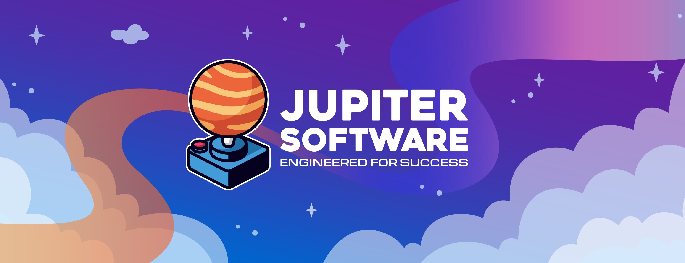

  
  <!-- Jupiter Software Logo -->
  
  
  <h1>Jupiter Software</h1>
  
  
<b>Engineered for Success</b>

  
   
  
  

    
    &nbsp;
    
  

  

 

---

 

  
  <h2>💻 Technology Stack</h2>
  
  
<i>Our carefully selected tools and technologies</i>

  
   
  
  <!-- Frontend Technologies -->
  

    
<h3>🨠Frontend</h3>

     
    

      
      &nbsp;&nbsp;
      
      &nbsp;&nbsp;
      
      &nbsp;&nbsp;
      
      &nbsp;&nbsp;
      
      &nbsp;&nbsp;
      
    

    

      React • TypeScript • Next.js • Tailwind CSS • Vue.js • Storybook
    

  

  
   
  
  <!-- Backend Technologies -->
  

    
<h3>⚙️ Backend</h3>

     
    

      
      &nbsp;&nbsp;
      
      &nbsp;&nbsp;
      
      &nbsp;&nbsp;
      
      &nbsp;&nbsp;
      
      &nbsp;&nbsp;
      
    

    

      Node.js • Python • Express.js • Rust • GraphQL • Redis
    

  

  
   
  
  <!-- Database & Infrastructure -->
  

    
<h3>🗄️ Database & Infrastructure</h3>

     
    

      
      &nbsp;&nbsp;
      
      &nbsp;&nbsp;
      
      &nbsp;&nbsp;
      
      &nbsp;&nbsp;
      
      &nbsp;&nbsp;
      
    

    

      PostgreSQL • Firestore • AWS • Docker • Kubernetes • BigQuery
    

  

  

 

---

 

  
  <h2>🎯 What We Do</h2>
  
   
  
  <table>
    <tr>
      <td width="50%" align="center">
        <h3>🏗️ Full-Stack Development</h3>
        
Building scalable web applications with cutting-edge technologies and best practices

      </td>
      <td width="50%" align="center">
        <h3>☁️ Cloud Solutions</h3>
        
Designing and implementing cloud-native architectures for maximum scalability

      </td>
    </tr>
    <tr>
      <td width="50%" align="center">
        <h3>🤖 AI Integration</h3>
        
Leveraging artificial intelligence to create intelligent, adaptive solutions

      </td>
      <td width="50%" align="center">
        <h3>🛡️ Security First</h3>
        
Implementing robust security measures to protect your digital assets

      </td>
    </tr>
  </table>
  

 

---

 

  
  <h2>🌟 Our Work</h2>
  
  
<i>Check out our repositories and contributions across the organization</i>

  
   
  
  
  

 

---

 

  
  <h2>🏆 Our Impact</h2>
  
   
  
  <table>
    <tr>
      <td align="center" width="33%">
        <h3>50+</h3>
        
Projects Delivered

      </td>
      <td align="center" width="33%">
        <h3>100K+</h3>
        
Lines of Code

      </td>
      <td align="center" width="33%">
        <h3>99%</h3>
        
Client Satisfaction

      </td>
    </tr>
  </table>
  

 

---

 

  
  <h2>🤝 Let's Build Something Amazing Together</h2>
  
   
  
  <h3>Get in Touch</h3>
  
  

    <b>Email:</b> hello@jupitersoft.net 
    <b>Phone:</b> +1 (818) 900-8628 
    <b>Website:</b> <a href="https://jupitersoft.net">jupitersoft.net</a>
  

  
   
  
  

  
   
  
  © 2024 Jupiter Software LLC. All rights reserved.
  

