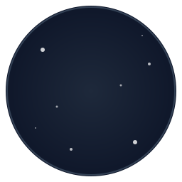

<!-- Header with Logo and Brand Statement -->

  
  <h1 style="font-size: 2.5rem; margin: 0.5rem 0;">Jupiter Software</h1>
  
<b>Engineered for Success</b>

  
Where Innovation Meets Excellence ✨

  
  

    
    &nbsp;
    
  

<!-- Jupiter Startups Section -->

  
  <h2 style="font-size: 2rem; margin: 1rem 0;">Jupiter Startups</h2>
  
We're passionate about helping new ideas grow. We partner with early-stage startups as technical co-founders to build amazing products.

   
  

<!-- What We Do -->

  <h2 style="font-size: 1.8rem;">🎯 What We Do</h2>
  
<em>From idea to impact, we build solutions that scale.</em>

  
  

    

      <h3 style="font-size: 1.3rem; margin-bottom: 1rem;">🏗️ Full-Stack Development</h3>
      
Building robust web applications with cutting-edge technologies.

    

    

      <h3 style="font-size: 1.3rem; margin-bottom: 1rem;">☁️ Cloud & DevOps</h3>
      
Designing cloud-native architectures for maximum scalability.

    

    

      <h3 style="font-size: 1.3rem; margin-bottom: 1rem;">🤖 AI Integration</h3>
      
Leveraging AI to create intelligent, adaptive solutions.

    

  

<!-- Our Technology -->

  <h2 style="font-size: 1.8rem;">💻 Our Technology</h2>
  
<em>The tools we use to build the future. Click an icon to learn more!</em>

  
  

    
    <!-- Frontend -->
    

      <h3 style="text-align: center; font-size: 1.4rem; margin-bottom: 1.5rem; color: #8e81f4;">🎨 Frontend</h3>
      

        

          
          React
        

        

          
          Next.js
        

        

          
          Vue.js
        

        

          
          TypeScript
        

        

          
          Tailwind CSS
        

        

          
          Figma
        

        

          
          Storybook
        

      

    

    <!-- Backend & Infrastructure -->
    

      <h3 style="text-align: center; font-size: 1.4rem; margin-bottom: 1.5rem; color: #f0a8c0;">🏛️ Backend & Infrastructure</h3>
      

        

          
          Node.js
        

        

          
          Python
        

        

          
          Rust
        

        

          
          Express
        

        

          
          GraphQL
        

        

          
          PostgreSQL
        

      

    

    <!-- Cloud & DevOps -->
    

      <h3 style="text-align: center; font-size: 1.4rem; margin-bottom: 1.5rem; color: #4ade80;">☁️ Cloud & DevOps</h3>
      

        

          
          AWS
        

        

          
          AWS Lambda
        

        

          
          GCP
        

        

          
          GCP Functions
        

        

          
          Google BigQuery
        

        

          
          Firebase
        

        

          
          Vercel
        

        

          
          Netlify
        

        

          
          Docker
        

        

          
          Kubernetes
        

        

          
          GitHub Actions
        

      

    

  

<!-- Impact and Contact Section -->

  <h2 style="font-size: 1.8rem;">🏆 Our Impact & Work</h2>
  
  

    

      <h3 style="font-size: 2.5rem; margin: 0; color: #8e81f4;">50+</h3>
      
Projects Delivered

    

    

      <h3 style="font-size: 2.5rem; margin: 0; color: #f0a8c0;">100K+</h3>
      
Lines of Code

    

    

      <h3 style="font-size: 2.5rem; margin: 0; color: #4ade80;">99%</h3>
      
Client Satisfaction

    

  

  
  

    
  

 

  <h2>🤝 Let's Build Something Amazing Together</h2>
  
Ready to transform your ideas into reality? We're here to help.

  
<b>Email:</b> <a href="mailto:hello@jupitersoft.net">hello@jupitersoft.net</a> &nbsp;|&nbsp; <b>Website:</b> <a href="https://jupitersoft.net" target="_blank">jupitersoft.net</a>

   
  © 2024 Jupiter Software LLC. All rights reserved.

