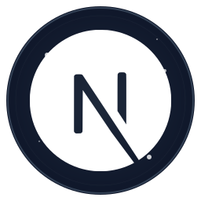
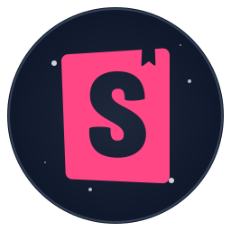

<!-- Header with Logo and Brand Statement -->

  
  <h1>Jupiter Software</h1>
  
<strong>Engineered for Success</strong>

  
<em>Where Innovation Meets Excellence ✨</em>

  
  

    
    
  

 

<!-- Jupiter Startups Section -->

  
  <h2 id="jupiter-startups">Jupiter Startups</h2>
  
<em>We're passionate about helping new ideas grow. We partner with early-stage startups as technical co-founders to build amazing products.</em>

  

    
  

 

<!-- What We Do -->

  <h2 id="what-we-do">🎯 What We Do</h2>
  
<em>From idea to impact, we build solutions that scale.</em>

<table>
<tr>
<td align="center" width="33%">
<h3>🏗️ Full-Stack Development</h3>

Building robust web applications with cutting-edge technologies.

</td>
<td align="center" width="33%">
<h3>☁️ Cloud & DevOps</h3>

Designing cloud-native architectures for maximum scalability.

</td>
<td align="center" width="33%">
<h3>🤖 AI Integration</h3>

Leveraging AI to create intelligent, adaptive solutions.

</td>
</tr>
</table>

 

<!-- Our Technology -->

  <h2 id="our-technology">💻 Our Technology</h2>
  
<em>The tools we use to build the future. Click an icon to learn more!</em>

<h3 align="center">🎨 Frontend</h3>

<h3 align="center">🏛️ Backend & Infrastructure</h3>

<h3 align="center">☁️ Cloud & DevOps</h3>

 

<!-- Impact and Contact Section -->

  <h2 id="our-impact">🏆 Our Impact & Work</h2>

<table>
<tr>
<td align="center" width="33%">
<h3>50+</h3>

<strong>Projects Delivered</strong>

</td>
<td align="center" width="33%">
<h3>100K+</h3>

<strong>Lines of Code</strong>

</td>
<td align="center" width="33%">
<h3>99%</h3>

<strong>Client Satisfaction</strong>

</td>
</tr>
</table>

  

    
  

 

  <h2 id="contact">🤝 Let's Build Something Amazing Together</h2>
  
<strong>Ready to transform your ideas into reality? We're here to help.</strong>

  

    <strong>Email:</strong> <a href="mailto:hello@jupitersoft.net">hello@jupitersoft.net</a> 
    <strong>Website:</strong> <a href="https://jupitersoft.net" target="_blank">jupitersoft.net</a>
  

  
© 2024 Jupiter Software LLC. All rights reserved.

