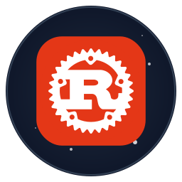
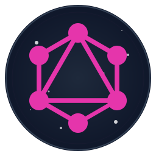
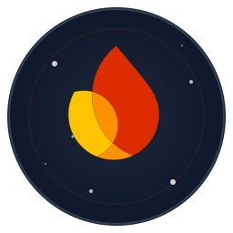

<!-- Header with Logo and Brand Statement -->

  
  <h1 style="font-size: 2.5rem; margin: 0.5rem 0;">Jupiter Software</h1>
  
<b>Engineered for Success</b>

  
Where Innovation Meets Excellence ✨

  
  

    
    &nbsp;
    
  

---

<!-- Jupiter Startups Section -->

  
  <h2 style="font-size: 2rem; margin: 1rem 0;">Jupiter Startups</h2>
  
We're passionate about helping new ideas grow. We partner with early-stage startups as technical co-founders to build amazing products.

   
  

---

<!-- What We Do -->

  <h2 style="font-size: 1.8rem;">🎯 What We Do</h2>
  
<em>From idea to impact, we build solutions that scale.</em>

  <table width="100%" border="0" cellpadding="10" cellspacing="0" style="max-width: 800px; margin-top: 1rem;">
    <tr valign="top">
      <td width="33%" align="center"><h3>🏗️ Full-Stack Development</h3>
Building robust web applications with cutting-edge technologies.
</td>
      <td width="33%" align="center"><h3>☁️ Cloud & DevOps</h3>
Designing cloud-native architectures for maximum scalability.
</td>
      <td width="33%" align="center"><h3>🤖 AI Integration</h3>
Leveraging AI to create intelligent, adaptive solutions.
</td>
    </tr>
  </table>

---

<!-- Our Technology -->

  <h2 style="font-size: 1.8rem;">💻 Our Technology</h2>
  
<em>The tools we use to build the future. Click an icon to learn more!</em>

  

    <h3 style="text-align: center; font-size: 1.2rem;">🎨 Frontend</h3>
    <table width="100%" border="0" cellpadding="10" cellspacing="0" style="table-layout: fixed;">
      <tr align="center">
        <td></td>
        <td></td>
        <td></td>
        <td></td>
        <td></td>
        <td></td>
        <td></td>
      </tr>
      <tr align="center" style="font-size: 0.8rem; color: #586069;">
        <td>React</td>
        <td>Next.js</td>
        <td>Vue.js</td>
        <td>TypeScript</td>
        <td>Tailwind CSS</td>
        <td>Figma</td>
        <td>Storybook</td>
      </tr>
    </table>
    <h3 style="text-align: center; font-size: 1.2rem;">🏛️ Infrastructure</h3>
    <table width="100%" border="0" cellpadding="10" cellspacing="0" style="table-layout: fixed;">
      <tr align="center">
        <td></td>
        <td></td>
        <td></td>
        <td></td>
        <td></td>
        <td></td>
        <td></td>
      </tr>
      <tr align="center" style="font-size: 0.8rem; color: #586069;">
        <td>Node.js</td>
        <td>Python</td>
        <td>Rust</td>
        <td>Express</td>
        <td>GraphQL</td>
        <td>Docker</td>
        <td>Kubernetes</td>
      </tr>
      <tr align="center">
        <td></td>
        <td></td>
        <td></td>
        <td></td>
        <td></td>
        <td></td>
        <td></td>
      </tr>
      <tr align="center" style="font-size: 0.8rem; color: #586069;">
        <td>AWS</td>
        <td>AWS Lambda</td>
        <td>GCP</td>
        <td>GCP Functions</td>
        <td>PostgreSQL</td>
        <td>Firebase</td>
        <td>Google BigQuery</td>
      </tr>
    </table>
  

---

<!-- Impact and Contact Section -->

  <h2 style="font-size: 1.8rem;">🏆 Our Impact & Work</h2>
  <table border="0" cellpadding="10" cellspacing="0" style="max-width: 600px; margin: 1rem auto;">
    <tr>
      <td align="center"><h3>50+</h3>
Projects Delivered
</td>
      <td align="center"><h3>100K+</h3>
Lines of Code
</td>
      <td align="center"><h3>99%</h3>
Client Satisfaction
</td>
    </tr>
  </table>
   
  

 

---

  <h2>🤝 Let's Build Something Amazing Together</h2>
  
Ready to transform your ideas into reality? We're here to help.

  
<b>Email:</b> <a href="mailto:hello@jupitersoft.net">hello@jupitersoft.net</a> &nbsp;|&nbsp; <b>Website:</b> <a href="https://jupitersoft.net" target="_blank">jupitersoft.net</a>

   
  © 2024 Jupiter Software LLC. All rights reserved.

